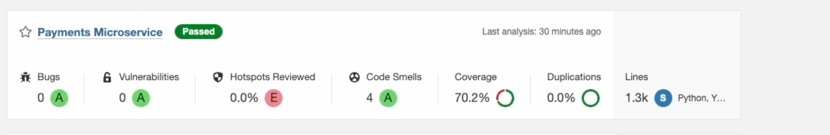

# Microsserviço de Pagamentos

Este repositório contém o microsserviço responsável pelo processamento e gerenciamento de pagamentos da plataforma.

## Tecnologias

- **Framework**: FastAPI
- **Linguagem**: Python 3.10+
- **Banco de Dados**: PostgreSQL
- **Comunicação**: HTTP REST
- **Documentação API**: Swagger/OpenAPI
- **Testes**: Pytest + Behave
- **Cobertura de Testes**: Coverage.py
- **CI/CD**: GitHub Actions

## Estrutura do Projeto

```
tech/
├── api/
│   └── payment_router.py
├── domain/
│   └── entities/
│       └── payment.py
├── infra/
│   ├── databases/
│   │   └── database.py
│   ├── gateways/
│   │   └── http_order_gateway.py
│   └── repositories/
│       └── sql_alchemy_payment_repository.py
├── interfaces/
│   ├── controllers/
│   │   └── payment_controller.py
│   ├── gateways/
│   │   └── order_gateway.py
│   ├── repositories/
│   │   └── payment_repository.py
│   └── schemas/
│       └── payment_schema.py
└── use_cases/
    └── payments/
        ├── create_payment_use_case.py
        ├── get_payment_status_use_case.py
        └── webhook_payment_use_case.py
```

## Configuração do Ambiente

### Requisitos

- Python 3.10+
- PostgreSQL 13+

## Banco de Dados

### Modelo de Dados

```sql
CREATE TABLE payments (
    id SERIAL PRIMARY KEY,
    order_id INTEGER NOT NULL UNIQUE,
    amount DECIMAL(10, 2) NOT NULL,
    status VARCHAR(20) NOT NULL DEFAULT 'pending',
    payment_method VARCHAR(50) NOT NULL,
    transaction_id VARCHAR(100),
    created_at TIMESTAMP NOT NULL DEFAULT NOW(),
    updated_at TIMESTAMP NOT NULL DEFAULT NOW()
);
```

## Endpoints da API

- `POST /api/payments` - Cria um novo pagamento para um pedido
- `GET /api/payments/{order_id}` - Obtém o status do pagamento de um pedido
- `POST /api/webhook` - Endpoint para receber notificações de status de pagamento

## Fluxo de Pagamento

1. O microsserviço de Pedidos notifica que um novo pedido precisa de pagamento
2. O cliente envia uma solicitação de pagamento para `/api/payments`
3. O microsserviço de Pagamentos valida o pedido com o microsserviço de Pedidos
4. O pagamento é processado e seu status inicial é registrado
5. Quando o status do pagamento é atualizado, o Webhook é acionado
6. O microsserviço de Pedidos é notificado sobre o novo status do pagamento

## Integração com Outros Serviços

- **Microsserviço de Pedidos**: Valida a existência do pedido e atualiza seu status após o pagamento
- **Processador de Pagamentos Externo** (opcional): Integração com gateway de pagamento para processamento real

## Testes

### Executando Testes Unitários

```bash

cd tech 

# Execute todos os testes

pytest

# Execute testes com cobertura
pytest --cov=tech tests/

# Gere relatório HTML de cobertura
pytest --cov=tech --cov-report=html tests/
```

### Executando Testes BDD

```bash
# Execute todos os testes BDD
behave tests/tech/bdd/features/

# Execute um cenário específico
behave tests/tech/bdd/features/payments.feature

# Execute testes com tags específicas
behave tests/tech/bdd/features/ --tags=webhook,credit_card
```

#### Exemplo de Cenário BDD

```gherkin
Feature: Processamento de pagamentos
  Como um cliente
  Eu quero processar um pagamento para meu pedido
  Para finalizar minha compra

  Scenario: Processar pagamento com cartão de crédito
    Given que existe um pedido com ID "123" e valor de "99.90"
    When eu submeto um pagamento com cartão de crédito para este pedido
    Then o pagamento deve ser processado com sucesso
    And o status inicial do pagamento deve ser "processing"
    And o microsserviço de pedidos deve ser notificado
```

### Cobertura de Testes




> **Nota**: A imagem acima mostra a estrutura de diretórios dos testes, incluindo a organização dos testes BDD.
